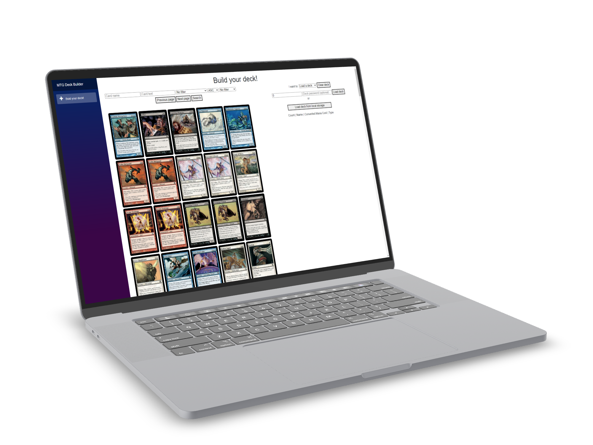

# Magic The Gathering Deck Builder

A .NET application with a Blazor frontend that allows users to build MTG Decks and query cards

### Features:
- GraphQL API with data of all cards and artists:
    - Query all cards with power and toughness filters
    - Query all artists with limit filters
    - Query specific artists by id
- Minimal API that allows the user to post and delete their Decks
- Web API that allows users to retrieve cards, decks and sets
- Blazor GUI that ties it all together

### Run locally:
Make sure you have the database installed and replace the connection strings to the database in the different projects. Run the SQL script that will create an additional database, and modify the API base adresses in in the program file of the Web project if necessary.

